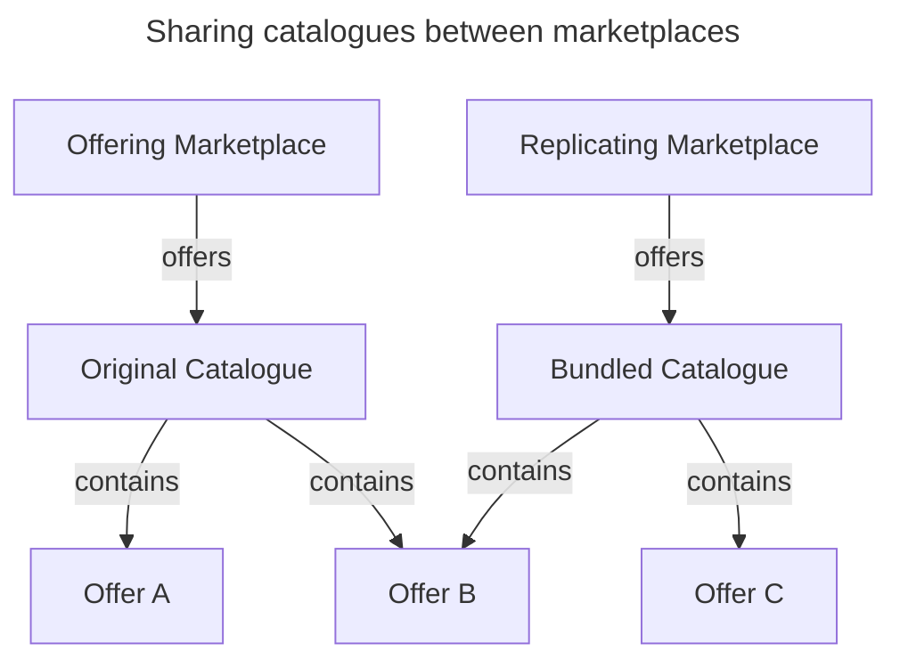

# Catalogue Offerings Verifiable Signature

> **Author:** Simon Petrac \<spetrac@nicos-ag.com\>

<!-- https://mermaid.live/edit -->



### Verifiable Credential and Presentation

To make the following explanations easier, I will introduce a minimal view on VC and VP.

Basically, if you ignore the role of certain attributes, a VC technically consists of data and a signature.
A VP is not so different, because it just means that the data includes some child VC/VP:

```yaml
VC:
  data: any
  signature: cryptographic proof on data

VP:
  data:
    children: VC/VP
    other: any
  signature: cryptographic proof on data
```

### Catalogue and Offerings

For further reference, the catalogue and the offerings will be minimally defined as follows:

```yaml
Offering:
  provider: identifier
  product: any

Catalog:
  marketplace: identifier
  offerings: list of offerings
```

Offerings and Catalogues should be able to define policies for usage or replication control, so just add them to the basic model:

```yaml
Offering:
  provider: identifier
  product: any
  policies: optional policies

Catalogue:
  marketplace: identifier
  offerings: list of offerings
  policies: optional policies
```

### Catalogue Signature with VC

Packaging a catalogue as VC is very easy. Lets use the diagram at the top as reference:

```yaml
VC:
  data: Original Catalogue
    marketplace: Offering Marketplace
    offerings:
      - Offer A:
        provider: A corp.
        product: A prod.
      - Offer B:
        provider: B corp.
        product: B prod.
  signature: proof on data from "Offering Marketplace"
```

The signature from the _Offering Marketplace_ indeed verifies the integrity of the catalogue.
There is no way for the _Replicating Marketplace_ to change this catalogue without invalidating the signature.
The problem is that nothing stops the _Replicating Marketplace_ to just take the offerings out of the VC and package them into their own VC:

```yaml
VC:
  data: Bundled Catalogue
    marketplace: Replicating Marketplace
    offerings:
      - Offer B:
        provider: B corp.
        product: B prod.
      - Offer C:
        provider: C corp.
        product: C prod.
  signature: proof on data from "Replicating Marketplace"
```

To anyone accessing the marketplace, the VC looks like a valid signed catalogue with offerings that seem to originate an the _Replicating Marketplace_.
Worse is that the _Replicating Marketplace_ could even change the offerings, e.g. to add additional fees for the marketplace. 
This could only be fixed by signing the offerings individually.

### Catalog Signature with VP and Offerings with VC

Increasing the effort of signing the offerings can solve some issues with the replication:

```yaml
VP:
  data:
    marketplace: Offering Marketplace
    # offerings will now be empty
    children:
      - VC:
        data: Offer A
          provider: A corp.
          product: A prod.
        signature: proof on data from "Offering Marketplace"
      - VC:
        data: Offer B
          provider: B corp.
          product: B prod.
        signature: proof on data from "Offering Marketplace"
  signature: proof on data from "Offering Marketplace"
```

The problem now is that the _Replicating Marketplace_ could also just take the contents from the VP/VCs and package them with their own signatures.
This also means they could strip any possible policies from the offerings, 
but it can be solved by signing the offerings individually with credentials from the provider:

```yaml
VP:
  data:
    marketplace: Offering Marketplace
    policies: marketplace replication policies
    children:
      - VC:
        data: Offer A
          provider: A corp.
          product: A prod.
          policies: product usage policies
        signature: proof on data from "A corp."
      - VC:
        data: Offer B
          provider: B corp.
          product: B prod.
          policies: offering replication policies
        signature: proof on data from "B corp."
  signature: proof on data from "Offering Marketplace"
```

This verifies that an offerings comes from a specific provider and the offerings itself cannot be manipulated,
because the _Replicating Marketplace_ has no access to the credentials of the providers to re-generate the signature for a manipulated offering.
Any policies defined in the offering are included in the signature, so they cannot be removed.
The only thing that could be stripped now is the source marketplace and the marketplace policies,
because the _Replicating Marketplace_ can just replace them with its own identifier and signature.

It seems that the only thing that cannot be stripped is any data that is included in the offering and signed by provider credentials.

### Catalog included in Offerings VC

To be perfectly safe from any manipulation, any information regarding an offering must be included in the offering itself 
and signed by the provider of that offering, not the marketplace. There is also no way to define marketplace policies
that are not included in the offerings themselfes. A consequence of that would be that policies can never change after the creation of an offering.
In the case that information or policies of the marketplace change, all offerings must be signed again be their corresponding providers.

```yaml
Catalogue:
  # marketplace is irrelevant, because it could be stripped anyway
  # policies are also irrelevant for the same reason
  offerings:
    - VC:
      data: Offer A
        provider: A corp.
        product: A prod.
        policies: product usage policies
        sourceMarketplace: Offering Marketplace # very important to guarantee integrity
        marketplacePolicies: marketplace replication policies # could also be appended to the offer policies
      signature: proof on data from "A corp."
    - VC:
      data: Offer B
        provider: B corp.
        product: B prod.
        policies: offering replication policies
        sourceMarketplace: Offering Marketplace # very important to guarantee integrity
        marketplacePolicies: marketplace replication policies # could also be appended to the offer policies
      signature: proof on data from "B corp."
```

Now, the _Replicating Marketplace_ has to conform to the semantics of the offerings and is just able to bundle the original offerings.

```yaml
Catalogue:
  offerings:
    - VC:
      data: Offer B
        provider: B corp.
        product: B prod.
        policies: offering replication policies
        sourceMarketplace: Offering Marketplace
        marketplacePolicies: marketplace replication policies
      signature: proof on data from "B corp."
    - VC:
      data: Offer C
        provider: C corp.
        product: C prod.
        policies: product usage policies
        sourceMarketplace: Replicating Marketplace
        marketplacePolicies: marketplace replication policies
      signature: proof on data from "C corp."
```

If they want to make changes to an offering, like including themselfes as an intermediate marketplace or adding additional marketplace fees, 
they would have to get a signature from the original provider. This means a change on a replicated offer can only be done be the provider
on the source marketplace, or at least signed by the provider credentials on the source marketplace.

```yaml
Catalogue:
  offerings:
    - VP:
      data:
        intermediateMarketplace: Replicating Marketplace
        additionalFees: any # or whatever the Replicating Marketplace requested to add
        children:
          - VC:
            data: Offer B
              provider: B corp.
              product: B prod.
              policies: offering replication policies
              sourceMarketplace: Offering Marketplace
              marketplacePolicies: marketplace replication policies
            signature: proof on data from "B corp."
      signature: proof on data from "B corp."
    - VC:
      data: Offer C
        provider: C corp.
        product: C prod.
        policies: product usage policies
        sourceMarketplace: Replicating Marketplace
        marketplacePolicies: marketplace replication policies
      signature: proof on data from "C corp."
```

### Catalogue Signature with VP and Catalogue included in Offerings VC

Of course we could go one step further and package the catalogue as VP anyway to make the catalogue itself shareable between parties
while on the other hand making it immune to manipulation:

```yaml
VP:
  data:
    marketplace: Offering Marketplace
    policies: marketplace catalogue exchange policies
    children:
      - VC:
        data: Offer A
          provider: A corp.
          product: A prod.
          policies: product usage policies
          sourceMarketplace: Offering Marketplace
          marketplacePolicies: marketplace replication policies
        signature: proof on data from "A corp."
      - VC:
        data: Offer B
          provider: B corp.
          product: B prod.
          policies: offering replication policies
          sourceMarketplace: Offering Marketplace
          marketplacePolicies: marketplace replication policies
        signature: proof on data from "B corp."
  signature: proof on data from "Offering Marketplace"
```

```yaml
VP:
  data:
    marketplace: Replicating Marketplace
    policies: marketplace catalogue exchange policies
    children:
      - VP:
        data:
          intermediateMarketplace: Replicating Marketplace
          additionalFees: any
          children:
            - VC:
              data: Offer B
                provider: B corp.
                product: B prod.
                policies: offering replication policies
                sourceMarketplace: Offering Marketplace
                marketplacePolicies: marketplace replication policies
              signature: proof on data from "B corp."
        signature: proof on data from "B corp."
      - VC:
        data: Offer C
          provider: C corp.
          product: C prod.
          policies: product usage policies
          sourceMarketplace: Replicating Marketplace
          marketplacePolicies: marketplace replication policies
        signature: proof on data from "C corp."
  signature: proof on data from "Offering Marketplace"
```

### Resumee

The mechanisms for a change on a replicated offering are quite complicated, if everything must be signed be the provider, 
but this is the only way I can think of to ensure the data integrity of catalogues, offerings and conditions on usage or replication.
Signatures of the marketplace alone are not enought to ensure that changes to the original data can always be recognized.

Because of the simplified view on entities and credentials, the exact representation as VC/VP and the supported attributes 
still needs to be developed in detail. The processes to safely manage provider credentials and make provider signatures
publicly verifiable must be developed as well, because it will not suffies to publish the public marketplace keys.
