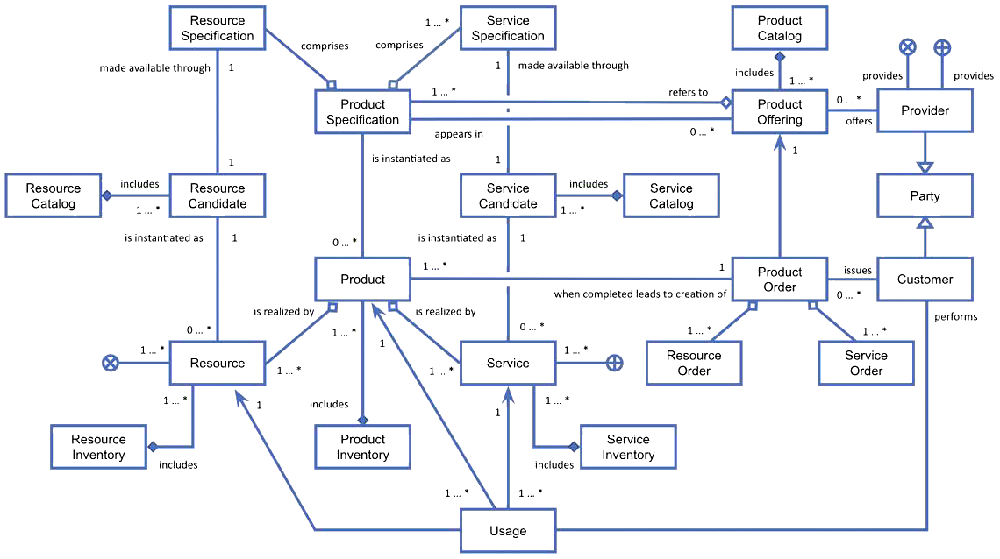

# Catalogue Replication and Visibility

## Principles

1. A marketplace (P, Publisher) can’t expose offerings from another marketplace (S, Source)
   if the latter does not agree.
2. A marketplace (S) can’t force another marketplace (P) to publish its own (S)  offerings.

## Approach

1. In the current implementation of the DOME shared catalog (the DTL) every offering published in a marketplace (S)
   catalog is technically retrievable by other marketplaces. _**Currently, no access control is in place,
   but it’s planned to be.**_
2. As a _**first approach**_, we can assume that a successful retrieval of an offering by a marketplace (P)
   from another marketplace (S), entitles the retriever (P) to publish it in its marketplace.
   _**Thus, “successful retrieval” \<=\> “right to publish”**_. However, there might be situations
   where an offering reaches a marketplace even if the source marketplace/provider didn't intend to.
   This might happen because of bugs, hacking, replication outside the scope of DOME, etc.
3. A _**trusted approach**_ to this situation is to _**embed the replication policies**_ into the offering itself
   and _**digitally sign the offering**_. The impact of such an approach is:
    1. A potential _**publishing marketplace (P) has the means to verify it’s entitled to publish an offering**_
       by verifying the signature of the offering and by checking the embed policies are fulfilled by itself.
    2. Whenever a publisher (P) exposes an offering that it is not entitled to expose according to the embedded policy,
       the _**source marketplace/provider (S) can rely on its digitally signed offering/policy
       to legally act against the publisher**_.

With approaches B and C, upon an attempt from a marketplace P to retrieve any offering from a marketplace S,
the latter can enforce whatever access control policy it decides, based on requester properties
and/or other contextual information. This way, _**principle 1 is guaranteed**_ for source marketplaces.

_**Principle 2**_ is fully in the control of the various (potentially) publishing marketplaces.
Assuming they’ve been able to retrieve an offering from a source marketplace, they can enforce
any policy they define (e.g. based on source identity, offering content, etc.) and filter out
the offering from their own marketplace.

*Note: although the approaches B and C have been introduced here to cope with the catalog replication process, they
perfectly apply to any entity circulating in the DOME ecosystem (e.g. orders, bills, invoices, etc.)*

## Technical Approach

Three major features need to be realized in order to achieve the above goal:

1. Controlling catalog replication (for sources)
2. Controlling incoming offerings (for publishers)
3. Controlling selective disclosure of offerings properties to customers (involves sources and publishers)

The rest of this section provides some more details on how this can be achieved.

### Controlling Catalog Replication (i.e Access Control policies)

A marketplace operator (_**source marketplace**_) wants to set **replication policies based on various criteria**
to control **where its product offerings can be exposed** (_**sink marketplace**_).
Replication can apply to single offerings or to entire catalogs.

> As of 2 Apr 2024, the following criteria have emerged from a survey within the consortium:
>
> 1. individual sink marketplaces (including DOME) \[DA, DHUB, TD, ELLIOT\]
> 2. country/zone of the sink marketplace \[TD, CF, DigitelTS\]
> 3. and/or/not combinations of the above

Replication policies are a ‘desiderata’ from source marketplaces.
No other marketplace is forced to publish if it doesn’t agree.

In general the replication process involves two actors and two phases:

1. The source marketplace decides what to (ideally) replicate, where and under what conditions.
2. The sink marketplace becomes aware of such a replication wish and, if agreed,
   proceeds with the replication of the offering/catalog.

From a practical point of view, it was agreed that the process could work as follows:

1. The source marketplace creates an offering and stores it locally (i.e it stays in the local access node).
   At the same time, the source marketplace defines some usage control policies
   for that offering/catalog (through the GUI and translated to ODRL). Such policies are embedded
   in the offering itself which is also digitally signed.
2. The creation of the offering will trigger a blockchain notification to all interested marketplaces (access nodes)
   who can access the endpoint of the offering/catalog for retrieval.
3. When the sink marketplace tries to access the catalog, the source marketplace will enforce
   the access control policies (through PDP/PEP) written in the offering itself.
   If the requestor matches the access policies, the offering is returned.
4. To safeguard itself, the sink marketplace should double check it’s entitled to expose the offering
   by evaluating itself the replication policy (since it’s embedded in the offering).
5. Now, it’s up to the sink marketplace to decide whether to expose the offering or not.
   However, if it agrees to publish, this should happen according to _**visibility policies**_ (see below).
   The whole step number 5 is elaborated in the following sections.

**Q:** how to manage a change in the replication policy (in particular, any restriction of it)
after a catalog has been already replicated?

**A:** in general, a given version of an offering that has been published and replicated can’t be retracted,
since there can be active/ongoing procurements for it. However, a new version
can bring changes (relaxations/restrictions) in the policies.

#### Who is involved in the process?

Being the above process _**mostly on the source side**_, every marketplace in the federation is free
to implement this as it wishes (or do not implement it at all or do a naive implementation,
if they decide their offerings are public to everybody). They can also rely on simpler implementation
(e.g. only relying on access control, without embedding any policy in the offering) but this
will reduce their capability to legally act against misuses.

The _**DOME central marketplace (i.e. the BAE)**_ should implement it as we’re discussing and defining here.
Also, since the support is being introduced in the BAE, any marketplace adopting such technology
can benefit from such an available feature.

### Controlling Incoming Offerings (i.e. Acceptance policies)

The DOME marketplace operator (thus, through the BAE) can set acceptance policies based on criteria to control
which offerings from other providers can be **exposed on the DOME marketplace**. Criteria can consider attributes
of the source marketplace (e.g. legal information, certification schemes, country, domain of activity, etc.)
as well of the catalog/offering (e.g. certifications, type/category of the service, …)

> As of 2 Apr 2024, the following criteria have emerged from a survey within the consortium:
>
> 1. individual source marketplaces \[DA\]
> 2. certification of the offering/provider \[DHUB\]
> 3. country/zone of the source marketplace \[CF\]
> 4. type (category?) of the offering \[EG, ED\]
> 5. based on directives accepted by the source marketplace (e.g. GDPR, eCommerce directive, etc) \[DigitelTS\]
> 6. accepting nothing \[ELLIOT\]
> 7. and/or/not combinations of the above

#### Who is involved in the process?

Being this process entirely on the sink side, any federated marketplace can manage this as it wishes.
This means that, upon receiving a ‘offering-related’ blockchain event from a source marketplace,
the sink marketplace can decide to do nothing (i.e. even not implementing the feature, or ignoring the event),
or publish everything they receive, or enforce any custom rule or manage it by manual processes, no matter.

Focusing on the DOME central marketplace, it should include the following features:

- A GUI to express/browse/update acceptance policies (in a simplified way)
- A low-level language to express acceptance policies (ODRL)
- A filtering mechanism so that any offering available for replication is checked against such rules.
  Whenever rules are passed, the offering/catalog becomes automatically visible on the DOME marketplace.

As before, since this feature will be realized in the BAE, any marketplace adopting such technology
can benefit from such a feature.

### Addressing the Customers (i.e. Visibility policies)

A marketplace operator can set visibility policies based on criteria (e.g., customer properties) to control
**which customers (within a sink federated marketplaces) can see its offerings**. Also, depending
on some other criteria (e.g., registered or unregistered user), a seller might want to set visibility policies on
**specific offering properties** (e.g., price, contractual documentation, etc.)

Similar to catalog replication, but enforcement here can only be done on the sink marketplace.
This means that the the catalog/offering content should be made available to the sink
(the source can’t know in advance who will access the sink marketplace); then it’s up to the sink marketplace to 1\)
evaluate if the offering has to be shown or not to the customer and 2\) show only allowed offering metadata.

> As of 2 Apr 2024, the following **properties** are considered for selective disclosure:
>
> 1. contractual documentation \[DA, EG, EHT, ELLIOT\]
> 2. price \[EG, ELLIOT, TOPIX\]
> 3. name of the provider \[DHUB, EG\]
> 4. related services \[DA\]
> 5. lifecycle status of the offering \[DA\]
> 6. every attribute might be hidden \[TD, CF\]
> 7. nothing needs to be hidden \[DigitelTS\]
>
> And here are the **criteria** to underlying that selective disclosure:
>
> 1. any criteria \[TD, CF\] (feasible at low-level/ODRL, but not realistic
     > for a simple GUI unless the GUI is a text editor for ODRL :P )
> 2. anonymous vs authenticated \[EHT\]
> 3. disclosed upon request of the customer \[DA, TOPIX\]

#### Who is involved in the process?

Any source marketplace that wants to enable selective disclosure on its own _**offerings
must make visibility policies available to the sink**_ (similarly to replication policies,
by enriching the offering itself, similarly to what we said for replication policies)
so that the sink marketplaces know how to behave wrt their customers.

On the other hand, sink marketplaces must understand the policies and must enforce them whenever a customer
is accessing an offering. With this respect, it is worth considering developing a reusable filtering component that,
given an offering, an ODRL policy and contextual information (i.e. customer attributes, etc..) produces a partial view
of the offering itself to be presented to the customer. 
