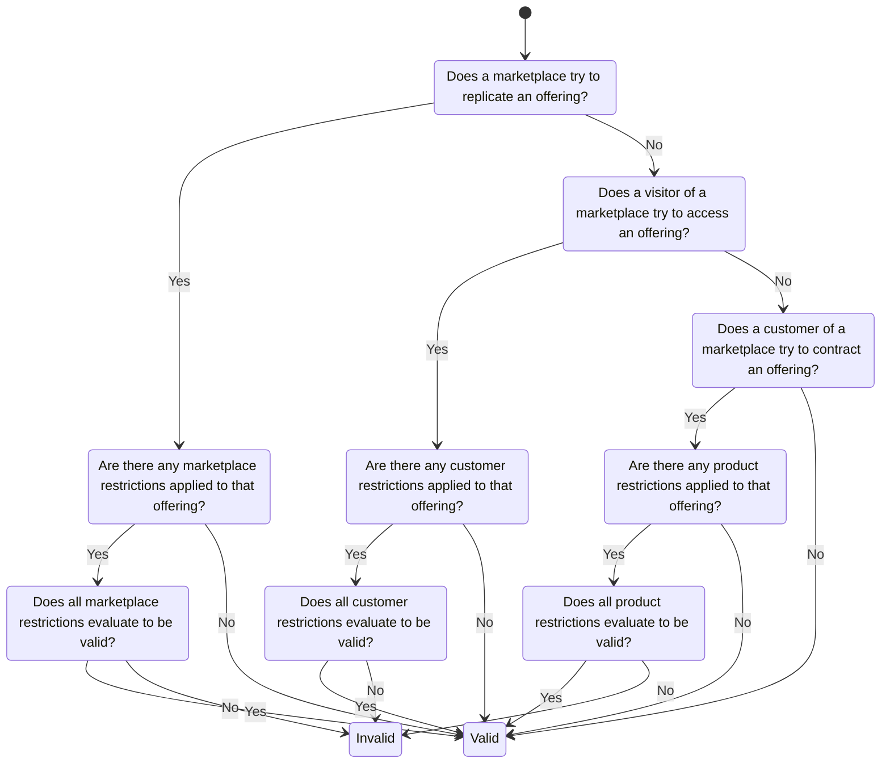
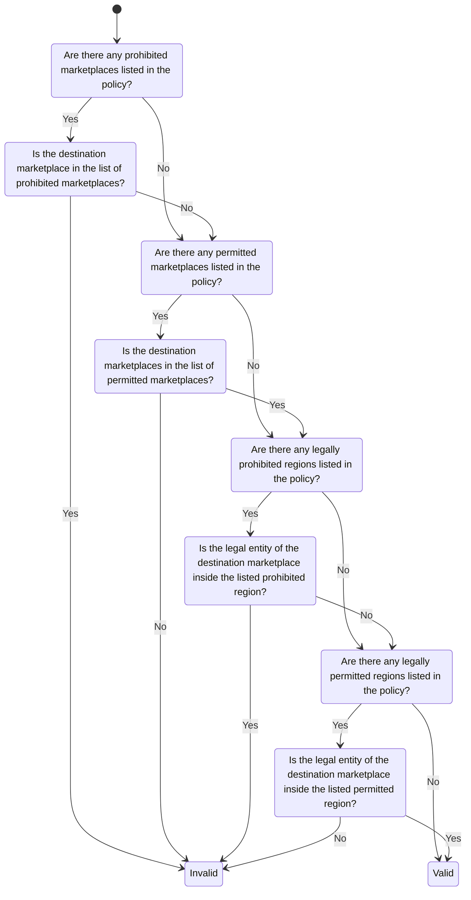
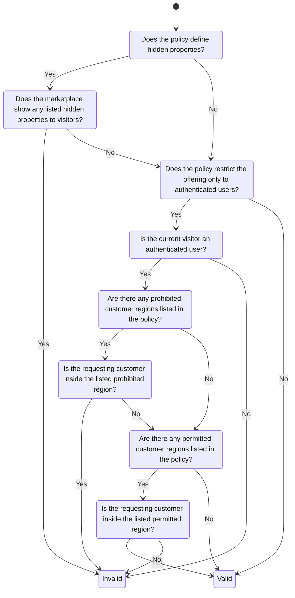
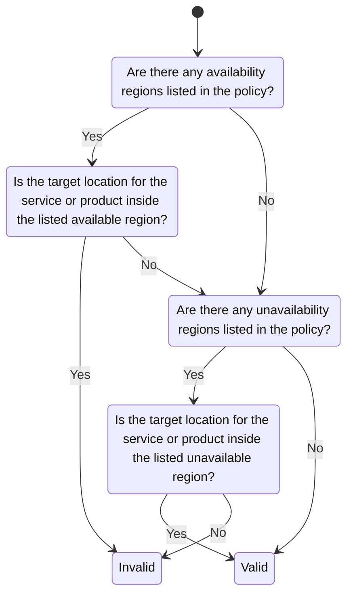

# Policy Evaluation Strategy

> **Author:** Simon Petrac \<spetrac@nicos-ag.com\>

## Simplified Approach

- [Schemas](../schemas/simplified/)

The different term types of the simplified approach are used for different scenarios,
therefore only one term type must be used at a specific enforcement point,
e.g. at replication of offerings only the marketplace restrictions are relevant.

> There can be as many terms on a product offering as needed.
> Usually, multiple terms are used for different term types,
> but they could also be used to specify different combinations of rules.
> Because each team is validated individually, an action like showing offerings to visitors
> is prohibited if even one associated term evaluates to invalid.

### Marketplace Restriction

A term definition that collects all attributes,
which specifies restrictions on a product offering for whole marketplaces.

> The enforcement of this term should ideally be done by the source marketplace
> before the offering gets replicated to another marketplace.

### Customer Restriction

A term definition that collects all attributes,
which specifies restrictions on product- and offering details for customer groups.

> The enforcement of this term can only be done by the offering marketplace.
> It should prevent data about the product to be leaked to non authorized customers.

### Product Restriction

A term definition that collects all attributes,
which specifies restrictions on a product itself.

> The enforcement of this term can only be done by the offering marketplace.
> It should prevent customers to contract offerings that cannot be supplied to them.
> Visibility is not restricted by this per se and enforcement of this term is not critical,
> because the provider can always deny a product request.

## ODRL Approach

- [Schemas](../schemas/odrl/)

> TODO