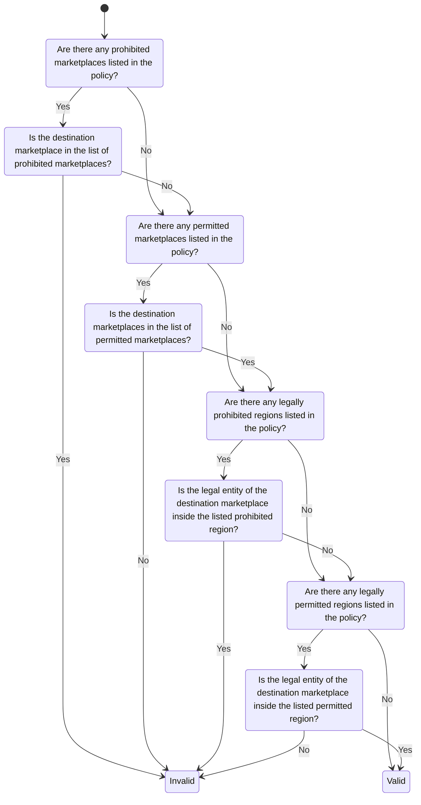
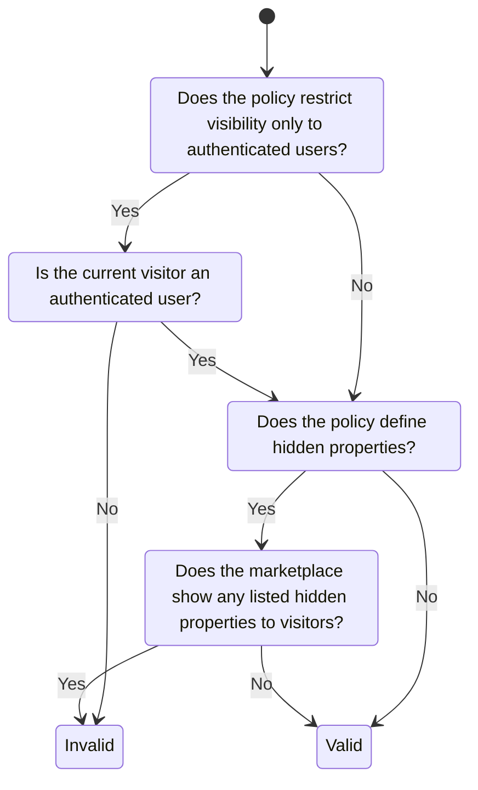
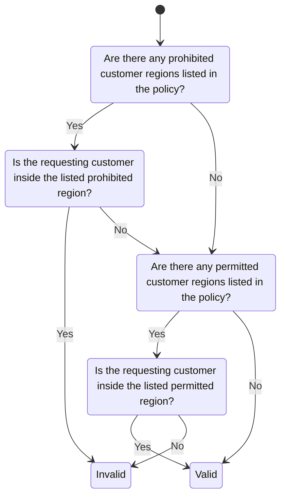

# Policy Evaluation Strategy

> **Author:** Simon Petrac \<spetrac@nicos-ag.com\>

## Simplified Approach

### Marketplace Restriction

### Visibility Restriction

### Customer Restriction

## ODRL Approach

> TODO