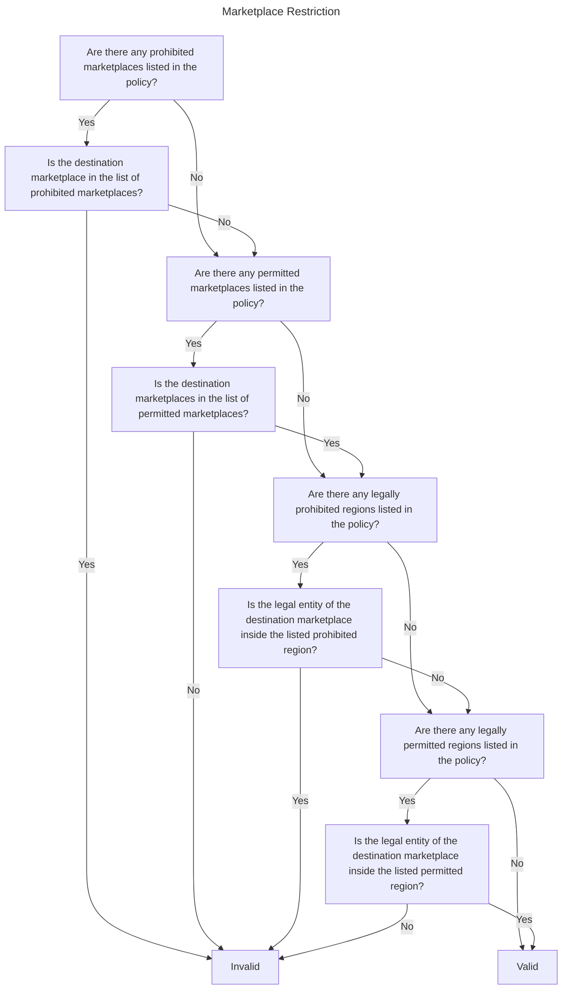
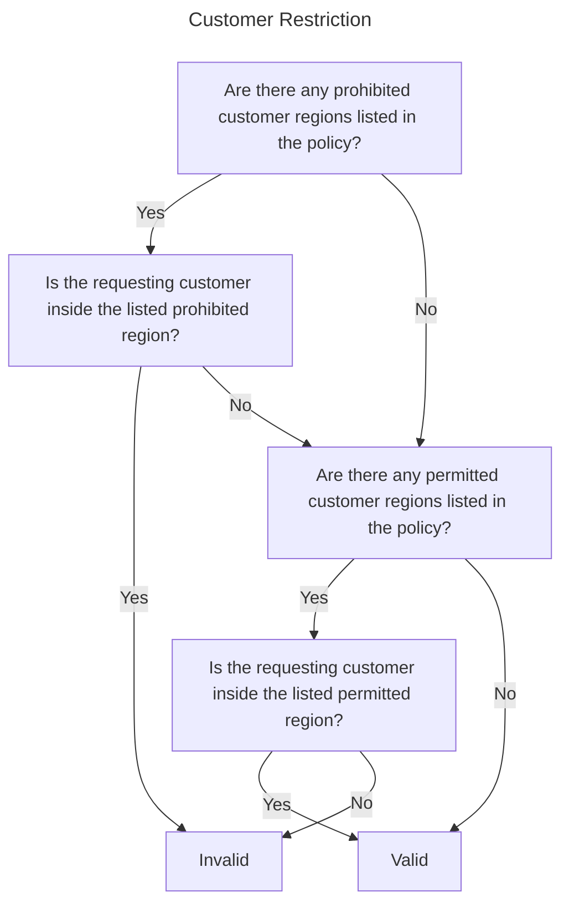
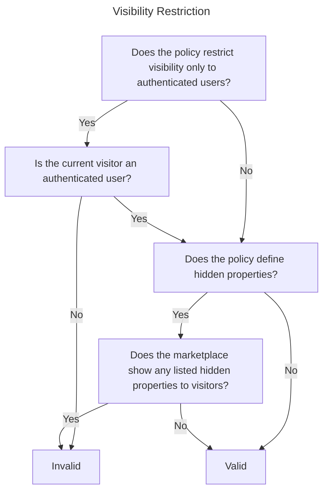

# Policy Evaluation Strategy

## Simplified Approach

### Marketplace Restriction

```mermaid
---
title: Marketplace Restriction
---
flowchart TD
  Q1["Are there any prohibited marketplaces listed in the policy?"]
  Q1 -- Yes --> Q2
  Q1 -- No --> Q3
  Q2["Is the destination marketplace in the list of prohibited marketplaces?"]
  Q2 -- Yes --> INVALID
  Q2 -- No --> Q3
  Q3["Are there any permitted marketplaces listed in the policy?"]
  Q3 -- Yes --> Q4
  Q3 -- No --> Q5
  Q4["Is the destination marketplaces in the list of permitted marketplaces?"]
  Q4 -- Yes --> Q5
  Q4 -- No --> INVALID
  Q5["Are there any legally prohibited regions listed in the policy?"]
  Q5 -- Yes --> Q6
  Q5 -- No --> Q7
  Q6["Is the legal entity of the destination marketplace inside the listed prohibited region?"]
  Q6 -- Yes --> INVALID
  Q6 -- No --> Q7
  Q7["Are there any legally permitted regions listed in the policy?"]
  Q7 -- Yes --> Q8
  Q7 -- No --> VALID
  Q8["Is the legal entity of the destination marketplace inside the listed permitted region?"]
  Q8 -- Yes --> VALID
  Q8 -- No --> INVALID
  VALID["Valid"]
  INVALID["Invalid"]
```

### Customer Restriction

```mermaid
---
title: Customer Restriction
---
flowchart TD
  Q1["Are there any prohibited customer regions listed in the policy?"]
  Q1 -- Yes --> Q2
  Q1 -- No --> Q3
  Q2["Is the requesting customer inside the listed prohibited region?"]
  Q2 -- Yes --> INVALID
  Q2 -- No --> Q3
  Q3["Are there any permitted customer regions listed in the policy?"]
  Q3 -- Yes --> Q4
  Q3 -- No --> VALID
  Q4["Is the requesting customer inside the listed permitted region?"]
  Q4 -- Yes --> VALID
  Q4 -- No --> INVALID
  VALID["Valid"]
  INVALID["Invalid"]
```

### Visibility Restriction

```mermaid
---
title: Visibility Restriction
---
flowchart TD
  Q1["Does the policy restrict visibility only to authenticated users?"]
  Q1 -- Yes --> Q2
  Q1 -- No --> Q3
  Q2["Is the current visitor an authenticated user?"]
  Q2 -- Yes --> Q3
  Q2 -- No --> INVALID
  Q3["Does the policy define hidden properties?"]
  Q3 -- Yes --> Q4
  Q3 -- No --> VALID
  Q4["Does the marketplace show any listed hidden properties to visitors?"]
  Q4 -- Yes --> INVALID
  Q4 -- No --> VALID
  VALID["Valid"]
  INVALID["Invalid"]
```