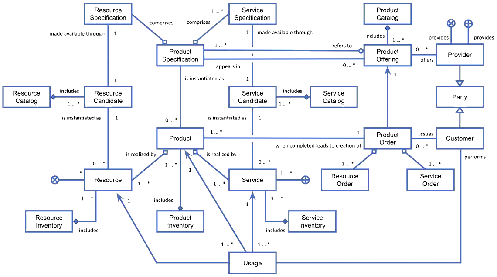
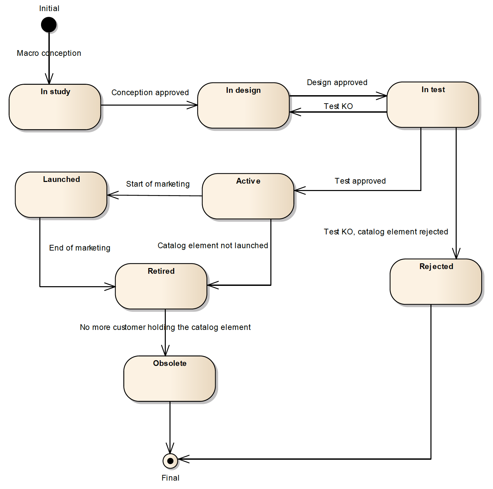
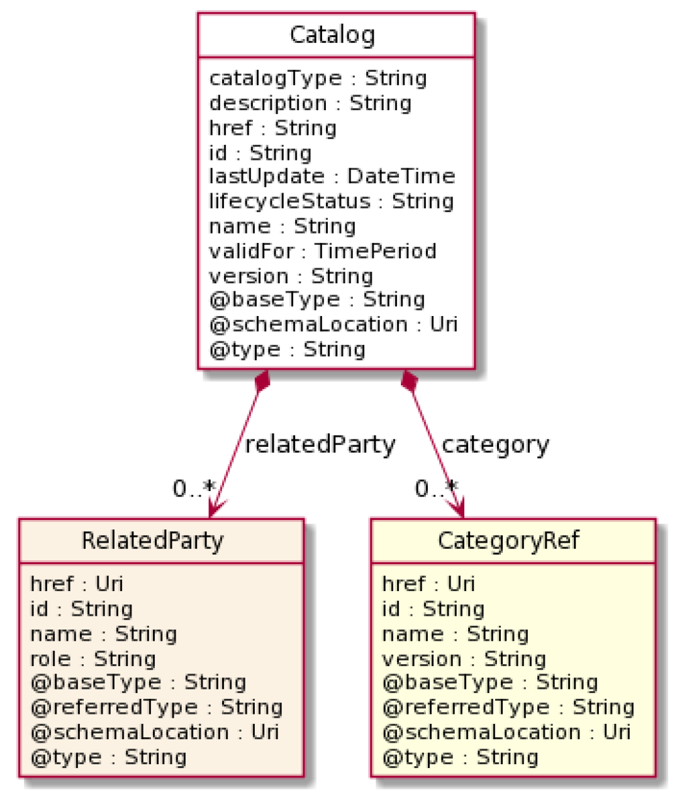
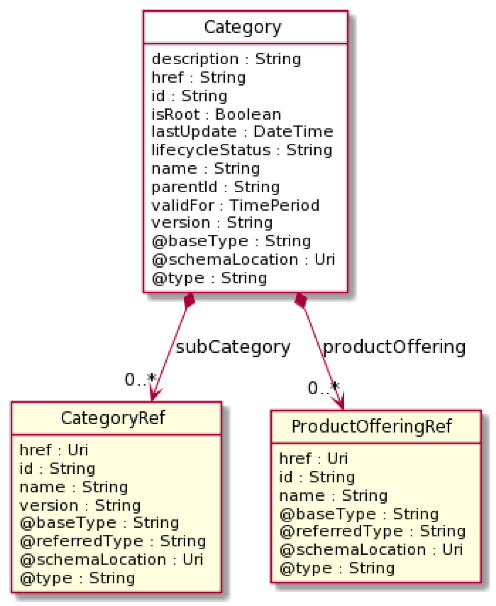
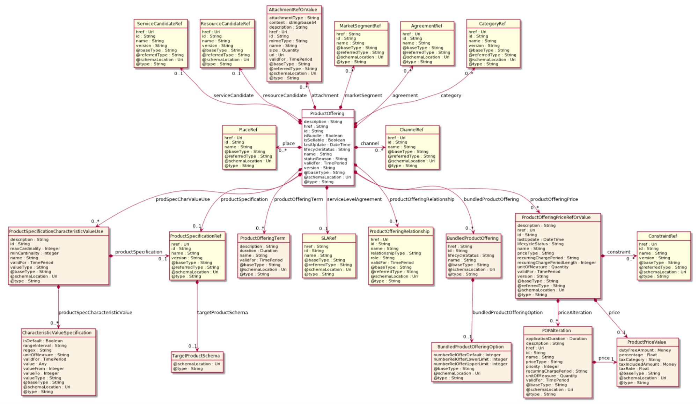
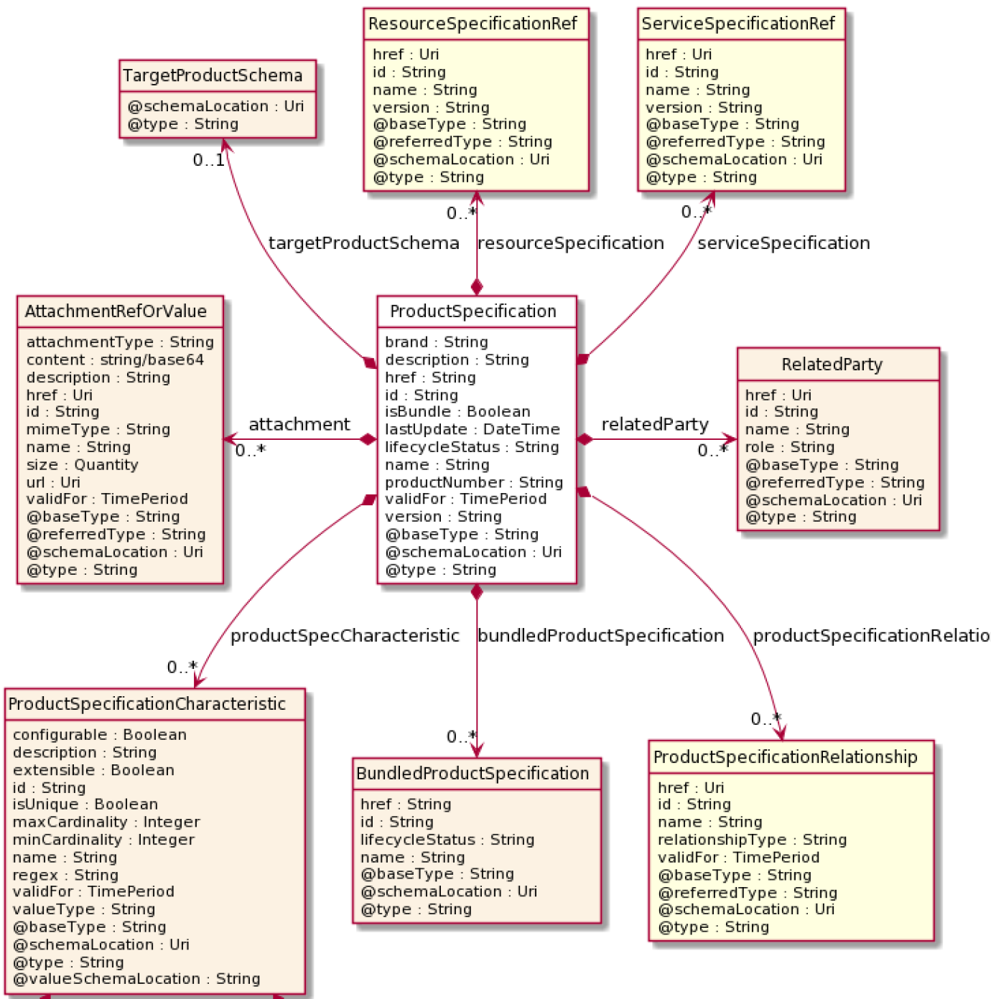
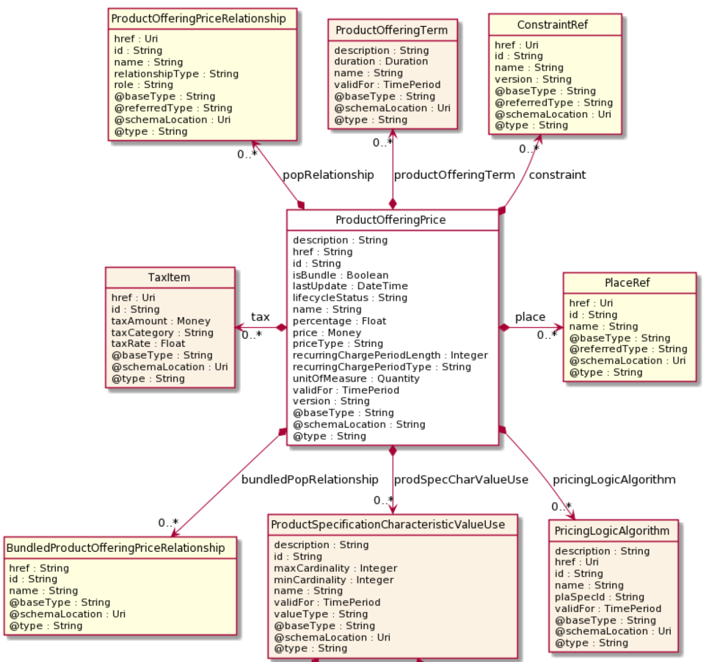

# TMForum APIs

## Basic Concepts

### Main Entities

A **Product Catalog** is a collection of **Product Offerings** intended for a set of specific **Distribution Channels**
and **Market Segments**.

A **Product** is created in the **Product Inventory** when a Product Offering is procured by a Party (customer or other
interested party) which means a **Product Order** has been issued and successfully completed. A Product is realized as a
combination of **Services** and/or **Resources** which get instantiated in a **Service Inventory** and a **Resource
Inventory**, respectively.

A Product Offering comprises the **Product Specification**, the **Agreement** that governs usage of derived products,
the associated **Product Offering Price**, the market segment it is targeted to, and other aspects which characterize
each of the products created when the Product Offering is procured. The Product Specification, in turn, includes
references to the specification of services and/or resources required to realize the Products linked to that Product
Specification (each Service Specification is made available through a **Service Candidate** in the **Service Catalog**
while each **Resource Specification** is made available through a **Resource Candidate** in a **Resource Catalog**,
respectively). There may be one or more Product Offerings around the same Product Specification (e.g., associated with
different prices or targeted to different market segments).

Each time a Product, Resource or Service is used, a **Usage** entity is created, which typically is used to calculate
how much can be charged to consumers and paid to providers.

> TMForum main entities

### Common properties of entities defined in TM Forum APIs

The following properties are common to all entities in the information model underlying TM Forum APIs:

- **href**: an URL that can be used to get the attributes of the entity, e.g.:
  https://mycsp.com:8080/tmf-api/serviceCatalogManagement/v3/serviceCatalog/3830
- **id**: the id of the entity, defined as last part of the href path, e.g., “3830”.
- **@type**: id identifying the type of the entity.
- **@baseType**: id of the type which the type identified with @type extends (equals @type if @type is a root type,
  i.e.,
  does not extend any other type).
- **@schemaLocation**: URL of the schema associated to the type.

Most of them (if not all) also include the following attributes

- **version**: version of the concrete entity (since it may evolve over time)
- **lastUpdated**: date and time of the last update of the entity
- **validFor**: the time period during which the given entity is valid

### Lifecycle Status

Some entities (e.g., Catalog) may have a Lifecycle Status property which describes where it is within a well defined
commercialization lifecycle.

> Entity lifecycle status

## Product Catalog Management API

The catalog management API allows the management of the entire lifecycle of elements in a catalog and the consultation
of catalog elements during several processes such as ordering process, campaign management or sales management.

Provides a standardized solution for rapidly adding products to an existing Catalog. It brings the capability for
Service Providers to directly feed systems with the technical description of the products they propose to them.

### Product Catalog

A collection of **Product Offerings** intended for a specific **Distribution Channel** and **Market Segment**.

Properties of a **Catalog**:

- **version**: Product Catalog version
- **lastUpdate**: Date and time of the last update.
- **validFor**: The time period for which the Product Catalog is valid.
- **lifecycleStatus**: Indicates the lifecycle status of the Product Catalog.
- **name**: Name given to the catalog
- **description**: A narrative that explains in detail the catalog.
- **catalogType**: Whether the catalog includes products, services or resources
- **category**: List of category references (Points to category objects as defined in this API)
- **relatedParty**: List of parties related to the catalog. The parties should be valid parties registered in the Party
  Management API
    - id: Id of the Party in party management API
    - href: Reference of the party pointing to a Party resources as specified in the Party Management API
    - role: Role the party is playing in the related catalog (free string).

> Product Catalog

### Category

The category resource is used to group product offerings, service and resource candidates. Categories can contain other
categories and/or product offerings, resources or service candidates.

Properties of a **Category**:

- **version**: Category version
- **lastUpdate**: Date and time of the last update.
- **validFor**: The time period for which the Category is valid.
- **lifecycleStatus**: Indicates the lifecycle status of the Category.
- **name**: Name given to the catalog
- **description**: A narrative that explains in detail the category.
- **isRoot**: Whether the category is a root category or not.
- **parentID**: Id of the parent category of the category is not root
- **subCategory**: List of category references pointing to the child categories
- **productOffering**: List of references pointing to Product Offerings that are included in this category (see
  description of Product offering objects as defined in this API). Product offerings that are included in this category.

> Catalog

### Product Offering

Represents offerings on products that are orderable from the provider of the catalog. It includes specification of the
products, pricing information and other characteristics of the Product that gets created when a Product Offering is
procured (.

Properties of a **Product Offering**:

- **version**: Product offering version
- **lastUpdate**: Date and time of the last update.
- **validFor**: The time period for which the product offering is valid.
- **lifecycleStatus**: Indicates the lifecycle status of the product offering.
- **StatusReason**:  A string providing complementary information on the value of the lifecycle status attribute.
- **name**: Name of the product offering.
- **description**: A narrative that explains in detail what the product offering is.
- **attachment**: A list of attachment references or values. Complements the description of an element (for instance a
  product) through video, pictures, etc.
- **category**: List of Category references pointing to categories that apply to the product offering
- **place**: A list of references to places where products linked to this product offering are sold or delivered.
- **channel**: A list of references to channels through which the product offering is being sold.
- **marketSegment**: A list of market segment references. provides references to the corresponding market segment as
  target of product offerings. A market segment is grouping of Parties, GeographicAreas, SalesChannels, and so forth.
- **agreement**: A list of agreement references. Agreements are defined in the Agreement Management API. An agreement
  represents a contract or arrangement, either written or verbal and sometimes enforceable by law, such as a service
  level agreement or a customer price agreement. An agreement involves a number of other business entities, such as
  products, services, and resources and/or their specifications
- **isBundle**: Whether the product offering is a bundle product offering or not.
- **bundledProductOffering**: List of product offering references pointing to the product offerings included in the
  bundle, if the product offering is a bundle.
- **isSellable**: If false the offering only can be sold within a bundle. Therefore it is true when can be sold
  stand-alone.
- **ProductSpecification**: Reference to the product specification to which the product offering is related.
- **ProdSpecCharValueUse**: Includes the list of product specification characteristic values that are valid in the
  context of the product offering.
- **ProductOfferingPrice**: List of references to Product Offering Prices that apply to the product offering. The price
  is valid for a defined period of time and may not represent the actual price paid by a customer.
- **productOfferingTerm**: A list of references to Product Offering Terms, each of which refers to a condition under
  which the product offering is made available to customers, such as the commitment period. Each term comprises:
    - name
    - description
    - duration: length of time associated to the term
    - validFor: period of dates during which the term may apply
- **ProductOfferingRelationship**: A list of product offering relationships. A relationship between this product
  offering and other product offerings.
- **ResourceCandidate**:  List of references to ResourceCandidates as defined in Resource Catalog API. Resource
  Candidates make Resource Specifications available for inclusion in Product Offerings.
- **ServiceCandidate**: List of references to ServiceCandidates as defined in the Service Catalog API. Service
  Candidates make Service Specification available for inclusion in Product Offerings.
- **Agreement**: Reference to a service level agreement. A service level agreement (SLA) is a type of agreement that
  represents a formal negotiated agreement between two parties designed to create a common understanding about products,
  services, priorities, responsibilities, and so forth. The SLA is a set of appropriate procedures and targets formally
  or informally agreed between parties in order to achieve and maintain specified Quality of Service.

> Product offering

### Product Specification

Is a detailed description of some of the attributes that will characterize Products created when a Product Offering is
successfully ordered (procured).

Properties of a **Product Specification**:

- **version**: Product specification version
- **lastUpdate**: Date and time of the last update.
- **validFor**: The time period for which the product specification is valid.
- **lifecycleStatus**: Indicates the lifecycle status of the product specification.
- **name**: Name of the product specification.
- **productNumber**: An identification number assigned to identify the product specification.
- **brand**: The manufacturer or trademark of the product specification
- **description**: A narrative that explains in detail what the product specification is.
- **attachment**: List of attachments that complements the description of the product (i.e doc a video, etc)
- **isBundle**: Whether the product specification defines a product bundle
- **bundledProductSpecification**: If the product is a bundle, references to the list of product specifications included
  in the bundle
- **productSpecCharacteristic**: A list of product specification characteristics. A characteristic quality or
  distinctive feature of a ProductSpecification. The characteristic can be take on a discrete value, such as color, can
  take on a range of values, (for example, sensitivity of 100-240 mV), or can be derived from a formula (for example,
  usage time (hrs) = 30 - talk time *3). Certain characteristics, such as color, may be configured during the ordering
  or some other process.
- **productSpecificationRelationship**: List of Product Specification references. Examples are: migration, substitution,
  dependency or exclusivity relationships between/among product specifications.
- **relatedParty**: List of parties involved in the product specification as defined in the Party API, including the
  role the party has regarding the product specification.
- **resourceSpecification**: A list of Resource Specification references, where each Resource Specification is needed to
  realize the product specification. Resource Specification is defined in the Resource Catalog API.
- **serviceSpecification**: A list of Service Specification references, where each Service Specification is needed to
  realize the product specification. Service Specification is defined in the Service Catalog API.
- **targetProductSchema**: The reference object to the schema and type of target product which is described by product
  specification.

> Product specification

### Product Offering Price

Refers to a pricing model associated with a Product Offering. There may be multiple Product Offering Prices associated
to a Product Offering (see description of Product Offering).

Properties of a **Product Offering Price**:

- **version**: Product offering price version
- **lastUpdate**: Date and time of the last update.
- **validFor**: The time period for which the product offering price is valid.
- **lifecycleStatus**: Indicates the lifecycle status of the product offering price.
- **name**: Name given to the product offering price.
- **description**: A narrative that explains in detail what the product offering price is.
- **place**: A list of references to places where products with this product offering price are sold or delivered.
- **price**: The amount of money that characterizes the price.
- **priceType**:  A category that describes the price, such as recurring, discount, allowance, penalty, and so forth.
- **pricingLogicAlgorithm**: It represents an instantiation of an interface specification to external rating function.
  Some of the parameters of the interface definition may be already set (such as price per unit) and some may be
  gathered during the rating process from the event (such as call duration) or from ProductCharacteristicValues (such as
  assigned bandwidth).
- **recurringChargePeriodLength**: The period of the recurring charge: 1, 2, ... .It is set to zero if it is not
  applicable.
- **recurringChargePeriodType**: The period to repeat the application of the price Could be month, week…
- **tax**: An amount of money levied on the price of a Product by a legislative body.
- **unitOfMeasure**: A number and unit representing how many (for instance 1 dozen) of a ProductOffering is available at
  the offered price. Its meaning depends on the priceType. It could be a price, a rate, or a discount.
- **productOfferingTerm**: A list of reference to Product Offering Terms (see Product Offerings), that is conditions,
  under which the ProductOfferingPrice is made available to Customers. For instance, a Product Offering Price can be
  offered with multiple commitment periods.
- **isBundle**: Whether the product offering price is a bundle product offering price or not.
- **bundledPopRelationship**: this object represents a bundle relationship from a bundle product offering price (parent)
  to a simple product offering price (child). A simple product offering price may participate in more than one bundle
  relationship.
- **constraint**: a list of references to constraints, each of which represents a policy/rule applied to
  ProductOfferingPrice.
- **popRelationship**: A list of product offering prices related to this Product Offering Price, for example a price
  alteration such as allowance or discount.
- **prodSpecCharValueUse**: A use of the prodSpecCharValue by a ProductOfferingPrice to which additional properties (
  attributes) apply or override the properties of similar properties contained in
  ProductSpecificationCharacteristicValue. It should be noted that characteristics which their value(s) addressed by
  this object must exist in corresponding product specification. The available characteristic values for a
  ProductSpecificationCharacteristic in a Product specification can be modified at the ProductOffering and
  ProcuctOfferingPrice level. The list of values in ProductSpecificationCharacteristicValueUse is a strict subset of the
  list of values as defined in the corresponding product specification characteristics.

> Product offering price

## Product Ordering Management API

Provides a standardized mechanism for placing a product order with all of the necessary order parameters. The API
consists of a simple set of operations that interact with CRM/Order negotiation systems in a consistent manner. A
product order is created based on a product offering that is defined in a catalog. The product offering comprises the
specification of the product or bundle of products that will be created when the offering is procured and includes
characteristics such as pricing, product options and target market.

[//]: # (TODO)
