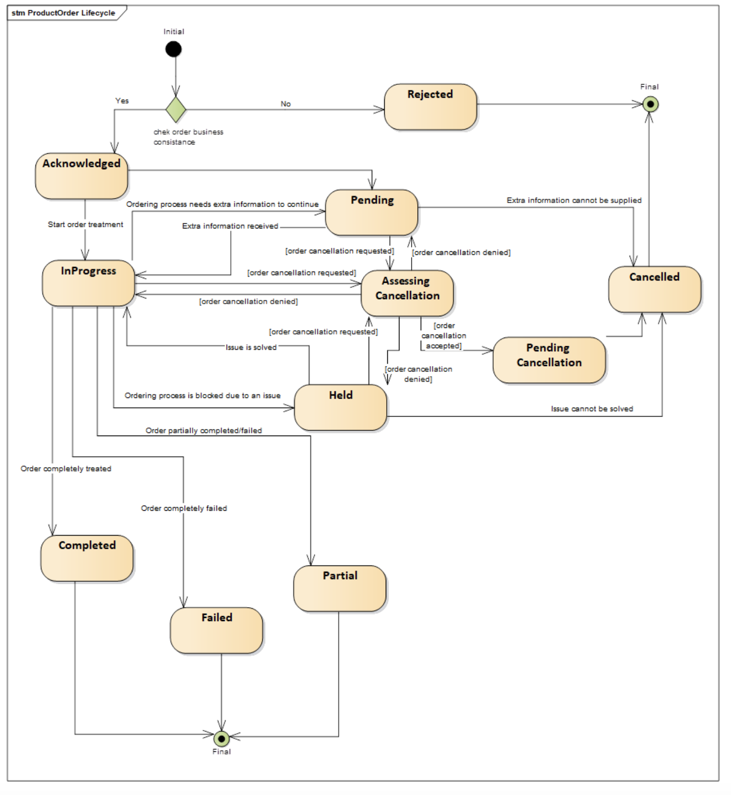
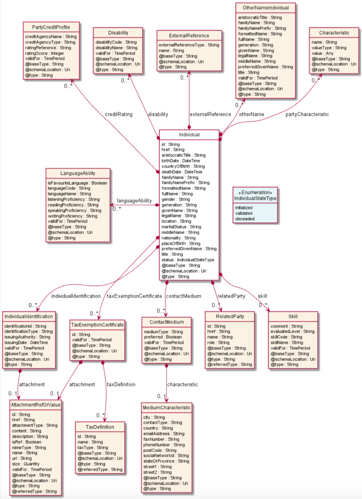

# TMForum APIs

## Basic Concepts

### Main Entities

A **Product Catalog** is a collection of **Product Offerings** intended for a set of specific **Distribution Channels**
and **Market Segments**.

A **Product** is created in the **Product Inventory** when a Product Offering is procured by a Party (customer or other
interested party) which means a **Product Order** has been issued and successfully completed. A Product is realized as a
combination of **Services** and/or **Resources** which get instantiated in a **Service Inventory** and a **Resource
Inventory**, respectively.

A Product Offering comprises the **Product Specification**, the **Agreement** that governs usage of derived products,
the associated **Product Offering Price**, the market segment it is targeted to, and other aspects which characterize
each of the products created when the Product Offering is procured. The Product Specification, in turn, includes
references to the specification of services and/or resources required to realize the Products linked to that Product
Specification (each Service Specification is made available through a **Service Candidate** in the **Service Catalog**
while each **Resource Specification** is made available through a **Resource Candidate** in a **Resource Catalog**,
respectively). There may be one or more Product Offerings around the same Product Specification (e.g., associated with
different prices or targeted to different market segments).

Each time a Product, Resource or Service is used, a **Usage** entity is created, which typically is used to calculate
how much can be charged to consumers and paid to providers.

### Common properties of entities defined in TM Forum APIs

The following properties are common to all entities in the information model underlying TM Forum APIs:

- **href**: a URL that can be used to get the attributes of the entity, e.g.:
  https://mycsp.com:8080/tmf-api/serviceCatalogManagement/v3/serviceCatalog/3830
- **id**: the id of the entity, defined as last part of the href path, e.g., “3830”.
- **@type**: id identifying the type of the entity.
- **@baseType**: id of the type which the type identified with @type extends (equals @type if @type is a root type,
  i.e.,
  does not extend any other type).
- **@schemaLocation**: URL of the schema associated to the type.

Most of them (if not all) also include the following attributes

- **version**: version of the concrete entity (since it may evolve over time)
- **lastUpdated**: date and time of the last update of the entity
- **validFor**: the time period during which the given entity is valid

### Lifecycle Status

Some entities (e.g., Catalog) may have a Lifecycle Status property which describes where it is within a well-defined
commercialization lifecycle.

## Product Catalog Management API

The catalog management API allows the management of the entire lifecycle of elements in a catalog and the consultation
of catalog elements during several processes such as ordering process, campaign management or sales management.

Provides a standardized solution for rapidly adding products to an existing Catalog. It brings the capability for
Service Providers to directly feed systems with the technical description of the products they propose to them.

### Product Catalog

A collection of **Product Offerings** intended for a specific **Distribution Channel** and **Market Segment**.

Properties of a **Catalog**:

- **version**: Product Catalog version
- **lastUpdate**: Date and time of the last update.
- **validFor**: The time period for which the Product Catalog is valid.
- **lifecycleStatus**: Indicates the lifecycle status of the Product Catalog.
- **name**: Name given to the catalog
- **description**: A narrative that explains in detail the catalog.
- **catalogType**: Whether the catalog includes products, services or resources
- **category**: List of category references (Points to category objects as defined in this API)
- **relatedParty**: List of parties related to the catalog. The parties should be valid parties registered in the Party
  Management API
    - id: Identifier of the Party in party management API
    - href: Reference of the party pointing to a Party resources as specified in the Party Management API
    - role: Role the party is playing in the related catalog (free string).

### Category

The category resource is used to group product offerings, service and resource candidates. Categories can contain other
categories and/or product offerings, resources or service candidates.

Properties of a **Category**:

- **version**: Category version
- **lastUpdate**: Date and time of the last update.
- **validFor**: The time period for which the Category is valid.
- **lifecycleStatus**: Indicates the lifecycle status of the Category.
- **name**: Name given to the catalog
- **description**: A narrative that explains in detail the category.
- **isRoot**: Whether the category is a root category or not.
- **parentID**: Identifier of the parent category of the category is not root
- **subCategory**: List of category references pointing to the child categories
- **productOffering**: List of references pointing to Product Offerings that are included in this category (see
  description of Product offering objects as defined in this API). Product offerings that are included in this category.

### Product Offering

Represents offerings on products that are orderable from the provider of the catalog. It includes specification of the
products, pricing information and other characteristics of the Product that gets created when a Product Offering is
procured.

Properties of a **Product Offering**:

- **version**: Product offering version
- **lastUpdate**: Date and time of the last update.
- **validFor**: The time period for which the product offering is valid.
- **lifecycleStatus**: Indicates the lifecycle status of the product offering.
- **StatusReason**:  A string providing complementary information on the value of the lifecycle status attribute.
- **name**: Name of the product offering.
- **description**: A narrative that explains in detail what the product offering is.
- **attachment**: A list of attachment references or values. Complements the description of an element (for instance a
  product) through video, pictures, etc.
- **category**: List of Category references pointing to categories that apply to the product offering
- **place**: A list of references to places where products linked to this product offering are sold or delivered.
- **channel**: A list of references to channels through which the product offering is being sold.
- **marketSegment**: A list of market segment references. provides references to the corresponding market segment as
  target of product offerings. A market segment is grouping of Parties, GeographicAreas, SalesChannels, and so forth.
- **agreement**: A list of agreement references. Agreements are defined in the Agreement Management API. An agreement
  represents a contract or arrangement, either written or verbal and sometimes enforceable by law, such as a service
  level agreement or a customer price agreement. An agreement involves a number of other business entities, such as
  products, services, and resources and/or their specifications
- **isBundle**: Whether the product offering is a bundle product offering or not.
- **bundledProductOffering**: List of product offering references pointing to the product offerings included in the
  bundle, if the product offering is a bundle.
- **isSellable**: If false the offering only can be sold within a bundle. Therefore, it is true when can be sold
  stand-alone.
- **ProductSpecification**: Reference to the product specification to which the product offering is related.
- **ProdSpecCharValueUse**: Includes the list of product specification characteristic values that are valid in the
  context of the product offering.
- **ProductOfferingPrice**: List of references to Product Offering Prices that apply to the product offering. The price
  is valid for a defined period of time and may not represent the actual price paid by a customer.
- **productOfferingTerm**: A list of references to Product Offering Terms, each of which refers to a condition under
  which the product offering is made available to customers, such as the commitment period. Each term comprises:
    - name
    - description
    - duration: length of time associated to the term
    - validFor: period of dates during which the term may apply
- **ProductOfferingRelationship**: A list of product offering relationships. A relationship between this product
  offering and other product offerings.
- **ResourceCandidate**:  List of references to ResourceCandidates as defined in Resource Catalog API. Resource
  Candidates make Resource Specifications available for inclusion in Product Offerings.
- **ServiceCandidate**: List of references to ServiceCandidates as defined in the Service Catalog API. Service
  Candidates make Service Specification available for inclusion in Product Offerings.
- **Agreement**: Reference to a service level agreement. A service level agreement (SLA) is a type of agreement that
  represents a formal negotiated agreement between two parties designed to create a common understanding about products,
  services, priorities, responsibilities, and so forth. The SLA is a set of appropriate procedures and targets formally
  or informally agreed between parties in order to achieve and maintain specified Quality of Service.

### Product Specification

Is a detailed description of some of the attributes that will characterize Products created when a Product Offering is
successfully ordered (procured).

Properties of a **Product Specification**:

- **version**: Product specification version
- **lastUpdate**: Date and time of the last update.
- **validFor**: The time period for which the product specification is valid.
- **lifecycleStatus**: Indicates the lifecycle status of the product specification.
- **name**: Name of the product specification.
- **productNumber**: An identification number assigned to identify the product specification.
- **brand**: The manufacturer or trademark of the product specification
- **description**: A narrative that explains in detail what the product specification is.
- **attachment**: List of attachments that complements the description of the product (i.e. doc a video, etc.)
- **isBundle**: Whether the product specification defines a product bundle
- **bundledProductSpecification**: If the product is a bundle, references to the list of product specifications included
  in the bundle
- **productSpecCharacteristic**: A list of product specification characteristics. A characteristic quality or
  distinctive feature of a ProductSpecification. The characteristic can be taken on a discrete value, such as color, can
  take on a range of values, (for example, sensitivity of 100-240 mV), or can be derived from a formula (for example,
  usage time (hrs) = 30 - talk time *3). Certain characteristics, such as color, may be configured during the ordering
  or some other process.
- **productSpecificationRelationship**: List of Product Specification references. Examples are: migration, substitution,
  dependency or exclusivity relationships between/among product specifications.
- **relatedParty**: List of parties involved in the product specification as defined in the Party API, including the
  role the party has regarding the product specification.
- **resourceSpecification**: A list of Resource Specification references, where each Resource Specification is needed to
  realize the product specification. Resource Specification is defined in the Resource Catalog API.
- **serviceSpecification**: A list of Service Specification references, where each Service Specification is needed to
  realize the product specification. Service Specification is defined in the Service Catalog API.
- **targetProductSchema**: The reference object to the schema and type of target product which is described by product
  specification.

### Product Offering Price

Refers to a pricing model associated with a Product Offering. There may be multiple Product Offering Prices associated
to a Product Offering (see description of Product Offering).

Properties of a **Product Offering Price**:

- **version**: Product offering price version
- **lastUpdate**: Date and time of the last update.
- **validFor**: The time period for which the product offering price is valid.
- **lifecycleStatus**: Indicates the lifecycle status of the product offering price.
- **name**: Name given to the product offering price.
- **description**: A narrative that explains in detail what the product offering price is.
- **place**: A list of references to places where products with this product offering price are sold or delivered.
- **price**: The amount of money that characterizes the price.
- **priceType**:  A category that describes the price, such as recurring, discount, allowance, penalty, and so forth.
- **pricingLogicAlgorithm**: It represents an instantiation of an interface specification to external rating function.
  Some of the parameters of the interface definition may be already set (such as price per unit) and some may be
  gathered during the rating process from the event (such as call duration) or from ProductCharacteristicValues (such as
  assigned bandwidth).
- **recurringChargePeriodLength**: The period of the recurring charge: 1, 2, ... .It is set to zero if it is not
  applicable.
- **recurringChargePeriodType**: The period to repeat the application of the price Could be month, week…
- **tax**: An amount of money levied on the price of a Product by a legislative body.
- **unitOfMeasure**: A number and unit representing how many (for instance 1 dozen) of a ProductOffering is available at
  the offered price. Its meaning depends on the priceType. It could be a price, a rate, or a discount.
- **productOfferingTerm**: A list of reference to Product Offering Terms (see Product Offerings), that is conditions,
  under which the ProductOfferingPrice is made available to Customers. For instance, a Product Offering Price can be
  offered with multiple commitment periods.
- **isBundle**: Whether the product offering price is a bundle product offering price or not.
- **bundledPopRelationship**: this object represents a bundle relationship from a bundle product offering price (parent)
  to a simple product offering price (child). A simple product offering price may participate in more than one bundle
  relationship.
- **constraint**: a list of references to constraints, each of which represents a policy/rule applied to
  ProductOfferingPrice.
- **popRelationship**: A list of product offering prices related to this Product Offering Price, for example a price
  alteration such as allowance or discount.
- **prodSpecCharValueUse**: A use of the prodSpecCharValue by a ProductOfferingPrice to which additional properties (
  attributes) apply or override the properties of similar properties contained in
  ProductSpecificationCharacteristicValue. It should be noted that characteristics which their value(s) addressed by
  this object must exist in corresponding product specification. The available characteristic values for a
  ProductSpecificationCharacteristic in a Product specification can be modified at the ProductOffering and
  ProcuctOfferingPrice level. The list of values in ProductSpecificationCharacteristicValueUse is a strict subset of the
  list of values as defined in the corresponding product specification characteristics.

## Product Ordering Management API

Provides a standardized mechanism for placing a product order with all of the necessary order parameters. The API
consists of a simple set of operations that interact with CRM/Order negotiation systems in a consistent manner. A
product order is created based on a product offering that is defined in a catalog. The product offering comprises the
specification of the product or bundle of products that will be created when the offering is procured and includes
characteristics such as pricing, product options and target market.

### Product Order

A **Product Order** is a type of order which can be used to place an order between a **Party** (customer or other
interested party) and a service provider. It is connected to a **Product Offering** in the **Product Catalog** and, when
successfully completed, leads to creation of a **Product** in the **Product Inventory**.

A product order has the following lifecycle:

The product order entity has the following attributes:

- **Agreement**: A list of references to agreements. Agreements defined in the context of the product order.
- **billingAccount**: A reference to a billing account of the customer
- **cancellationDate**: Date in which the order has been canceled (when cancelled).
- **cancellationReason**: Reason why the order is cancelled (when cancelled).
- **category**: Used to categorize the order from a business perspective that can be useful for the OM system (e.g. "
  enterprise", "residential", ...)
- **channel**: A list of related channels. Related channel to another entity. May be online web, mobile app, social ,etc
- **completionDate**: Date when the order was completed.
- **expectedCompletionDate**: Expected completion date amended by the provider
- **externalId**: ID given by the consumer and only understandable by him (to facilitate his searches afterwards).
- **note**: A list of notes. Extra information about a given entity.
- **notificationContact**: Contact attached to the order to send back information regarding this order.
- **orderDate**: Date when the order was created.
- **orderTotalPrice**: An amount, usually of money, that represents the actual price paid by the Customer for this item
  or this order. Pricing model object of each of the items
- **payment**: A list of references to Payment resources, as defined in the Payment Management API
- **priority**: A way that can be used by consumers to prioritize orders in OM system (from 0 to 4 : 0 is the highest
  priority, and 4 the lowest)
- **productOfferingQualification**: A list of product offering qualification references (
  ProductOfferingQualificationRef [*]). It's a productOfferingQualification that has been executed previously
- **productOrderItem**: . An identified part of the order. A product order is decomposed into one or more order items.
  Product offerings included in the order and action to perform add, modify, delete, noChange.
- **quote**: A list of quote references as defined in Quote Management API.
- **relatedParty**: A list of related parties. A related party defines a party or party role linked to a specific
  entity. It includes the customer, provider and other parties that may be involved.
- **requestedCompletionDate**: Requested delivery date from the requestor perspective.
- **requestedStartDate**: Order fulfillment start date wished by the requestor. This is used when, for any reason,
  requestor cannot allow seller to begin to operationally begin the fulfillment before a date
- **State**: Lifecycle status of the order.

## Product Inventory Management API

The Product API provides a standardized mechanism to retrieve product inventory information. The API consists of a
simple set of operations that interact with Inventory systems in a consistent manner. Usually, a product is created and
modified following a product order but could be also ‘directly’ modified for administrative reasons.

### Product Inventory

A Product Inventory is an example of Catalog where elements are Products.

### Product

A product offering procured by a customer or other interested party playing a party role. A product is realized as one
or more service(s) and / or resource(s).

The party role is a generalization of the customer role, so it is possible to instantiate products, services and
resources for parties playing a custom party role as a result of the creation of an agreement of any kind.

- **Name**: Name of the product. It could be the same as the name of the product offering.
- **Description**: Is the description of the product. It could be copied from the description of the Product Offering.
- **Agreement**: A list of agreement item references. An agreement represents a contract or arrangement, either written
  or verbal and sometimes enforceable by law, such as a service level agreement or a customer price agreement. An
  agreement involves a number of other business entities, such as products, services, and resources and/or their
  specifications. Agreement or agreement that triggers the instantiation of the product.
- **billingAccount**: Reference to the Billing Account of the customer as defined in the Account Management API.
- **isBundle**: Whether the acquired product is a bundle, it refers to the isBundle field of the productOffering.
- **isCustomerVisible**: Whether the product is visible to the customer
- **orderDate**: Date when the product was ordered
- **terminationDate**: Date when the product has been terminated (i.e. the term is over)
- **place**: A related place defines a place described by reference or by value linked to a specific entity
- **productOrderItem**: List of related productOrder items as defined in the Product Ordering Management API. The
  product order item which triggered product creation/change/termination.
- **productCharacteristic**: List of product characteristics as selected by the customer
- **productPrice**: Pricing model applied to the product (i.e. selected by the customer or other means)
- **productRelationship**: Linked products to the one instantiate, such as [bundled] if the product is a bundle, and you
  want to describe the bundled products inside this bundle; [reliesOn] if the product needs another already owned
  product to rely on (e.g. an option on an already owned mobile access product) [targets] or [isTargeted] (depending on
  the way of expressing the link) for any other kind of links that may be useful
- **productSerialNumber**:  Is the serial number for the product. This is typically applicable to tangible products e.g.
  Broadband Router.
- **productSpecification**: Reference to the acquired product specification
- **productOffering**: Reference to the acquired offering
- **productTerm**: Term applied to the product, taken from productOfferingTerm from product Offering
- **realizingResource**: List of references to Resources as defined in Resource Inventory API. Resources used in the
  product
- **realizingService**: List of references to services as defined by the Service Inventory API.
- **relatedParty**: A list of related parties, each of which defines party or party role linked to a specific entity.
- **startDate**: A date time (DateTime). Is the date from which the product starts.
- **status**: A product status type (ProductStatusType). Is the lifecycle status of the product.
- **terminationDate**: A date time (DateTime). Is the date when the product was terminated.

The product inventory API defines the following lifecycle for products:

## Agreement Management API

The Agreement API provides a standardized mechanism for managing agreements, especially in the context of partnerships
between partners.

### Agreement

An agreement represents a contract or arrangement, either written or verbal and sometimes enforceable by law, such as a
service level agreement or a customer price agreement. An agreement involves a number of other business entities, such
as products, services, and resources and/or their specifications.

An agreement entity has the following fields:

- name:
- description:
- **agreementAuthorization**: A list of business participants that need to sign the agreement.
    - **date**: Date of the signature
    - **SignatureRepresentation**: Indication that represents whether the signature is a physical paper signature or a
      digital signature
    - **State**: Status of the authorization
- **agreementItem**: A part of the agreement expressed in terms of a product offering and possibly including specific
  terms and conditions
    - **Products**: The list of products indirectly referred by this agreement item (since an agreement item refers
      primarily to product offerings).
    - **ProductOffering**: The list of product offerings referred by this agreement item
    - **TermOrCondition**: Aspects of the agreement not formally specified elsewhere in the agreement and that cannot be
      captured elsewhere in a formal notation, or automatically monitored and require a more human level of management:
        - description
        - id
        - validFor
- **agreementPeriod**: Period where the agreement is valid
- **agreementSpecification**: Reference to an Agreement Specification defined in this API
- **agreementType**: The type of the agreement. For example commercial.
- **associatedAgreement**: A list of agreement references related with the current one
- **characteristic**:  Describes a given characteristic of an object or entity through a name/value pair.
- **initialDate**: Initial date of the agreement
- **completionDate**: Date at which the agreement is complete
- **documentNumber**: A reference number assigned to an Agreement that follows a prescribed numbering system
- **engagedParty**: List of Parties as defined by the Party Management API engaged in the agreement with a specific
  role.
- **statementOfIntent**: An overview and goals of the Agreement
- **status**: The current status of the agreement. Typical values are: in process, approved and rejected.
- **version**: A string identifying the version of the agreement.

### Agreement Specification

A template of an agreement that can be used when establishing partnerships.

The agreement specification model has the following fields:

- name
- description
- **attachment**:  An attachment by value or by reference. An attachment complements the description of an element, for
  example through a document, a video, a picture.
- **isBundle**: if true, this agreement specification is a grouping of other agreement specifications. The list of
  bundled agreement specifications is provided by the specificationRelationship property.
- **lastUpdate**: A date time (DateTime). Date and time of the last update.
- **lifecycleStatus**: Lifecycle status of the specification
- **relatedParty**:  List of parties involved in the specification and its role on it.
- **serviceCategory**: Reference to Categories used for grouping recommendations.
- **specificationCharacteristic**: A list of agreement spec characteristics
- **specificationRelationship**: A relationship between agreement specifications. Typical relationships are substitution
  and dependency.
- **validFor**: A time period. The period for which the agreement specification is valid.
- **version**: A string. Agreement specification version.

## Resource Catalog Management API

### Resource Catalog

A resource catalog is a group of resource specifications made available through resource candidates that an organization
provides to the consumers

### Resource Category

The (resource) category resource is used to group resource candidates in logical containers. Categories can contain
other categories

### Resource Candidate

ResourceCandidate is an entity that makes a resource specification available to a catalog. A ResourceCandidate and its
associated resource specification may be published - made visible - in any number of resource catalogs, or in none. A
resource candidate exposes a resource specification in catalogs, establishing that the resource specification can now be
used in offers and instantiated in resources.

- name:
- description:
- **Category**: The categories in which this candidate is exposed
- **resourceSpecification**: Reference of the resource specification for this candidate.
- **lifecycleStatus**: Lifecycle status of the resource candidate.

### Resource Specification

Resources are physical or non-physical components (or some combination of these) within an enterprise's infrastructure
or inventory. They are typically consumed or used by services (for example a physical port assigned to a service) or
contribute to the realization of a Product (for example, a SIM card). They can be drawn from the Application, Computing
and Network domains, and include, for example, Network Elements, software, IT systems,content and information, and
technology components. A ResourceSpecification is an abstract base class for representing a generic means for
implementing a particular type of Resource. In essence, a ResourceSpecification defines the common attributes and
relationships of a set of related Resources, while Resource defines a specific instance that is based on a particular
ResourceSpecification

The resource specification model defines the following fields:

- name
- Description
- **Attachment**: Complements the description of an element (for instance a resource) through video, pictures ...
- **Category**: Category of the target resource like NetworkConnectivity, PhysicalLinks, Generic, L2Network and so on.
- **featureSpecification**: A list of Features for this specification.
- **isBundle**: A flag indicates that if this resource specification is a bundled specification (true) or single (false)
- **lifecycleStatus**: Used to indicate the current lifecycle status of the resource specification
- **relatedParty**: . A related party defines a party or party role linked to a specific entity.
- **resourceSpecCharacteristic**: A list of resource specification characteristics. A characteristic quality or
  distinctive feature of a ResourceSpecification. The characteristic can be taken on a discrete value, such as color,
  can
  take on a range of values, (for example, sensitivity of 100-240 mV), or can be derived from a formula (for example,
  usage time (hrs) = 30 - talk time *3). Certain characteristics, such as color, may be configured during the ordering
  or some other process.
- **resourceSpecRelationship**: A list of resource specification relationships. A migration, substitution, dependency or
  exclusivity relationship between/among resource specifications.

## Resource Ordering Management API

The REST API for Resource Order Management. It includes the model definition as well as all available operations.
Possible actions are creating, updating and retrieving Resource Orders (including filtering). A Resource Order API
provides a standard mechanism for placing a Resource Order with all necessary order parameters.

### Resource Order

A Resource Order is a request to provision a set of Resources (logical and physical) triggered by the request to
provision a Service through a Service Order

The resource order model has the following fields:

- **cancellationDate**:  Date when the order is cancelled - if cancelled,
- **cancellationReason**: Reason why the order is cancelled - if cancelled.
- **Category**: Used to categorize the order from a business perspective that can be useful for the order management
  system.
- **completionDate**: Date when the order was actually completed
- **expectedCompletionDate**: Date when the order is expected to be completed
- **externalReference**:  External reference of the individual or reference in another system.
- **Note**: A list of notes. Extra information about a given entity.
- **orderDate**: Date when the order was created.
- **orderItem**:  An identified part of the order. A resource order is decomposed into one or more order items.
    - **Action**: An order item action type (OrderItemActionType). action to be performed on the resource.
    - **Appointment**: Refers an appointment, such as a Customer presentation or internal meeting or site visit.
    - **Quantity**: Quantity ordered.
    - **resourceSpecification**: A resource specification reference
    - **State**: A resource order item state type. Possible values for the state of the order item.
- **orderType**: Name of the Resource Order type.
- **Priority**:  A way that can be used by consumers to prioritize orders in the OM system (such as: 0 is the highest
  priority, and 4 the lowest).
- **relatedParty**:  A related party defines party or party role linked to a specific entity
- **requestedCompletionDate**:  Requested delivery date from the requestor perspective
- **requestedStartDate**: Order start date wished by the requestor
- **startDate**: Date when the order was actually started,
- **State**: Possible values for the state of the order.

The Resource Ordering Management API defines the following lifecycle for Resource Orders:

## Resource Inventory Management API

Resource is an abstract entity that describes the common set of attributes shared by all concrete resources (e.g. TPE,
EQUIPMENT) in the inventory.

### Resource

The resource model defines the following fields:

- **activationFeature**: Applicable configuration features of a resource for activation.
- **administrativeState**: A resource administrative state type. Tracks the administrative state of the resource, such
  as locked, unlocked, shutdown and so on.
- **Attachment**: A list of attachment ref or values
- **Category**: Category of the concrete resource. e.g. Gold, Silver for MSISDN concrete
- **resource**.
- **startOperatingDate**: The date from which the resource is operating.
- **endOperatingDate**: The date till the resource is operating.
- **operationalState**: Tracks the operational state of the resource, such as enable, disable and so on.
- **Place**: A related place defines a place described by reference or by value linked to a specific entity.
- **relatedParty**: A related party defines a party or party role linked to a specific entity.
- **resourceCharacteristic**:  Describes a given characteristic of an object or entity through a name/value pair.
- **resourceRelationship**: Linked resources to the one instantiate, such as [bundled] if the resource is a bundle, and
  you want to describe the bundled resources inside this bundle; [reliesOn] if the resource needs another already owned
  resource to rely on (e.g. an option on an already owned mobile access resource) [targets] or [isTargeted] (depending
  on the way of expressing the link) for any other kind of links that may be useful.
- **resourceSpecification**: The ResourceSpecification is required to realize a ProductSpecification
- **resourceStatus**: Tracks the resource status of the resource, such as standby, alarm, available, reserved, suspended
  and so on
- **resourceVersion**: A field that identifies the specific version of an instance of a resource.
- **usageState**: Tracks the usage state of the resource, such as idle, active, busy and so on.

The Resource Inventory API defines the following lifecycle for Resources:

## Resource Function Activation and Configuration API

## Service Catalog Management API

### Service Catalog

A service catalog is a group of service specifications made available through service candidates that an organization
provides to the consumers (internal consumers like its employees or B2B customers or B2C customers). A service catalog
typically includes name, description and time period that is valid for. It will have a list of ServiceCandidate catalog
items. A ServiceCandidate is an entity that makes a ServiceSpecification available to a catalog. A ServiceCandidate and
its associated ServiceSpecification may be "published" - made visible -in any number of ServiceCatalogs, or in none.

### Service Category

The (service) category resource is used to group resource candidates in logical containers. Categories can contain other
categories

### Service Candidate

ServiceCandidate is an entity that makes a service specification available to a catalog. A ServiceCandidate and its
associated service specification may be published - made visible - in any number of service catalogs, or in none. One
service specification can be composed of other service specifications.

### Service Specification

ServiceSpecification is a class that offers characteristics to describe a type of service. Functionally, it acts as a
template by which Services may be instantiated. By sharing the same specification, these services would therefore share
the same set of characteristics.

- relatedParty
- **resourceSpecification**: A list of resource specification references (ResourceSpecificationRef [*]). A list of
  resource specification references (ResourceSpecificationRef [*]). The ResourceSpecification is required for a service
  specification with type ResourceFacingServiceSpecification (RFSS).
- **serviceLevelSpecification**: A list of service level specifications related to this service specification, and which
  will need to be satisfiable for corresponding service instances;
- serviceSpecCharacteristic:
- serviceSpecRelationship:

## Service Ordering Management API

The REST API for Service Order Management provides a standardized mechanism for placing a service order with all of the
necessary order parameters. It allows users to create, update & retrieve Service Orders and manage related
notifications.

### Service Order

The service order model defines the following fields:

- **cancellationDate**:  Date when the order is cancelled - if cancelled,
- **cancellationReason**: Reason why the order is cancelled - if cancelled.
- **Category**:  Used to categorize the order, useful for the OM system, such as: Broadband, TVOption.
- **errorMessage**: the error(s) cause an order status change
- **completionDate**: Date when the order was actually completed
- **expectedCompletionDate**: Date when the order is expected to be completed
- **externalReference**:  External reference of the individual or reference in another system.
- **jeopardyAlert**: A list of jeopardy alerts related to this order.
- **Milestone**: A list of milestones related to this order.
- **Note**: A list of notes. Extra information about a given entity.
- **orderDate**: Date when the order was created.
- **serviceOrderItem**:  A list of service order items to be processed by this order. .The service order item which
  triggered service creation/change/termination.
    - **itemAction**: An order item action type (OrderItemActionType). action to be performed on the service.
    - **Role**: role of the service order item for this service.
    - **serviceOrderHref**: Reference of the related entity
    - **serviceOrderId**:  Unique identifier of a related entity.
- **Priority**:  A way that can be used by consumers to prioritize orders in the OM system (such as: 0 is the highest
  priority, and 4 the lowest).
- **relatedParty**:  A related party defines party or party role linked to a specific entity
- **requestedCompletionDate**:  Requested delivery date from the requestor perspective
- **requestedStartDate**: Order start date wished by the requestor
- **startDate**: Date when the order was actually started,
- **State**: Possible values for the state of the order.

The Service Ordering Management API defines the following lifecycle for Service Orders:

## Service Inventory Management API

### Service

Service is a base class for defining the Service hierarchy. All Services are characterized as either being possibly
visible and usable by a Customer or not. This gives rise to the two subclasses of Service: CustomerFacingService and
ResourceFacingService.

The service model includes the following fields:

- **Category**: Is it a customer facing or resource facing service
- **Description**: Free-text description of the service.
- **endDate**: Date when the service ends
- **Feature**:  A list of features associated with this service.
- **hasStarted**: If TRUE, this Service has already been started.
- **isBundle**: If true, the service is a ServiceBundle which regroup a service hierarchy. If false, the service is an '
  atomic' service (hierarchy leaf).
- **isServiceEnabled**: If FALSE and hasStarted is FALSE, this particular Service has NOT been enabled for use - if
  FALSE and hasStarted is TRUE then the service has failed
- **isStateful**: If TRUE, this Service can be changed without affecting any other services
- **Name**: Name of the service.
- **Note**: A list of notes made on this service
- **Place**: A list of places. Used to define a place useful for the service (for example a geographical place where the
  service is installed).
- **relatedEntity**: A list of related entity in relationship with this service
- **relatedParty**: A list of related party references
- **serviceCharacteristic**: A list of characteristics that characterize this service
- **serviceDate**:  Date when the service was created (whatever its status)
- **serviceOrderItem**: A list of service order items related to this service. Service Order items that create or modify
  the current service.
- **serviceRelationship**: Describes links with other service(s) in the inventory
- **serviceSpecification**: Reference to the specification from which this service was instantiated
- **serviceType**: Business type of the service
- **startDate**:  Date when the service starts
- **startMode**: This attribute is an enumerated integer that indicates how the Service is started, such as: 0: Unknown;
  1: Automatically by the managed environment; 2: Automatically by the owning device; 3: Manually by the Provider of the
  Service; 4: Manually by a Customer of the Provider; 5: Any of the above
- **State**: The life cycle state of the service, such as designed, reserved, active, etc...
- **supportingResource**: A list of resource references. A list of supporting resources
- **supportingService**: . A collection of services that support this service (bundling, link CFS to RFS).

The Service inventory API defines the following lifecycle for services:

## Usage Management API

Provides standardized mechanisms for usage management such as creation, update, retrieval, import and export of a
collection of usages. The API manages both rated and non-rated usage. For example, it allows a service provider to 1)
retrieve usage generated by a partner service platform in order to rate it and 2) to provide rated usage to a partner
for consumption follow-up purposes.

### Usage

An occurrence of employing a Product, Service, or Resource for its intended purpose, which is of interest to the
business and can have charges applied to it. It is comprised of characteristics, which represent attributes of usage.

A usage entity has the following fields:

- **Description**: Description of the usage
- **ratedProductUsage**: A list of rated product usages. An occurrence of employing a
- product for its intended purpose with all rating details
    - bucketValueConvertedInAmount
    - **isBilled**: Whether the amount has been billed or not
    - isTaxExempt
    - offerTariffType
    - **productRef**: Reference to the rated product in the Product Inventory API.
    - ratingAmountType
    - ratingDate
    - taxExcludedRatingAmount
    - taxIncludedRatingAmount
    - taxRate
    - usageRatingTag
- **relatedParty**: A list of related parties.
- **Status**: Lifecycle status
- **usageCharacteristic**: A list of usage characteristics. Provides the value of a given characteristic. This field is
  used for saving the actual usage values.
- **usageDate**: Date of usage.
- **usageSpecification**: Reference to the usage specification. UsageSpecification is a detailed description of a usage
  event that is of interest to the business and can have charges applied to it. It is comprised of characteristics,
  which define all attributes known for a particular type of usage.
- **usageType**: Type of the usage as defined in its usage specification.

### Usage Specification

A detailed description of a usage event that are of interest to the business and can have charges applied to it. It is
comprised of characteristics, which define all attributes known for a particular type of usage

The usage specification model includes the following fields:

- **Description**: Description of the specification
- **isBundle**: Determines whether specification represents a single specification (false), or a bundle of
  specifications (true).
- **lifecycleStatus**: Lifecycle status
- **Name**: Name given to the specification
- **Attachment**: Attachments that may be of relevance to this specification, such as picture, document, media
- **Constraint**: A list of constraints references.
- **entitySpecRelationship**: List of entity spec relationships. Relationships with other specifications.
- **relatedParty**: List of related parties
- **specCharacteristic**: List of characteristics that the entity can take. This field is used to specify what usage
  metrics should be used and placed in the Usage model as usageCharacteristic.
- **validFor**: The period for which this REST resource is valid

## Party Management API

Provides a standardized mechanism for party management such as creation, update, retrieval, deletion and notification of
events.

Party can be an individual or an organization that has any kind of relationship with the enterprise.

### Individual

Individual represents a single human being (a man, woman or child). The individual can be a customer, an employee or any
other person that the organization needs to store information about.

- **aristocraticTitle**: Baron, Graf, Earl,….
- **birthDate**: DateTime birth date
- **countryOfBirth**: Country where the individual was born.
- **deathDate**: Date of dead, only if the status is Deceased
- **Disability**: List of disabilities. Lack or inadequate strength or ability.
- **familyName**: Contains the non-chosen or inherited name. Also known as last name in the Western context
- **familyNamePrefix**:  Family name prefix.
- **formattedName**: A fully formatted name in one string with all of its pieces in their proper place and all of the
  necessary punctuation. Useful for specific contexts (Chinese, Japanese, Korean,…).
- **fullName**:  Full name flatten (first, middle, and last names).
- **Gender**:
- **Generation**: Sr, Jr, III (the third),….
- **givenName**: First name of the individual
- **individualIdentification**: LIst of individual identifications. Represents our registration of information used as
  proof of identity by an individual (passport, national identity card, drivers license, social security number, birth
  certificate).
- **languageAbility**: List of language abilities. Ability of an individual to understand or converse in a language.
- **legalName**: Legal name or birth name (name one has for official purposes)
- **Location**: Temporary current location of the individual (may be used if the individual has approved its sharing).
- **maritalStatus**: Marital status (married, divorced, widow ...).
- **middleName**: Middles name or initial.
- **Nationality**
- **otherName**: List of other names. Keeps track of other names, for example the old name of a woman before marriage or
  an artist name.
- **placeOfBirth**: Reference to the place where the individual was born
- **preferredGivenName**: Contains the chosen name by which the individual prefers to be addressed. Note: This name may
  be a name other than a given name, such as a nickname
- **Skill**: LIst of skills. Skills evaluated for an individual with a level and possibly with a limited validity when
  an obsolescence is defined (Ex: the first-aid certificate first level is limited to one year and an update training is
  required each year to keep the level).
- **Status**: Lifecycle status of the individual
- **Title**:  Pr, Dr, Sir, ...
- **contactMedium**: List of contact mediums. Indicates the contact medium that could be used to contact the party.
- **creditRating**: A list of party credit profiles. An individual might be evaluated for its worthiness and this
  evaluation might be based on a credit rating given by a credit agency.
- **externalReference**: A list of external references. External reference of the individual or reference in other
  system
- **partyCharacteristic**: A list of characteristics. Describes a given characteristic of an object or entity through a
  name/value pair.
- **relatedParty**: A list of related parties. Related Entity reference. A related party defines a party or party role
  linked to a specific entity.
- **taxExemptionCertificate**: A list of tax exemption certificates. A tax exemption certificate represents a tax
  exemption granted to a party (individual or organization) by a tax jurisdiction which may be a city, state,
  country,... An exemption has a certificate identifier (received from the jurisdiction that levied the tax) and a
  validity period. An exemption is per tax types and determines for each type of tax what portion of the tax is
  exempted (partial by percentage or complete) via the tax definition.

### Organization

Organization represents a group of people identified by shared interests or purpose. Examples include business,
department and enterprise. Because of the complex nature of many businesses, both organizations and organization units
are represented by the same data.

- **existsDuring**: A period of time, either as a deadline (endDateTime only) a startDateTime only, or both.
- **isHeadOffice**:  If value is true, the organization is the head office.
- **isLegalEntity**: If value is true, the organization is a legal entity known by a national referential.
- **name**: Organization name (department name for example)
- **nameType**: Type of the name : Co, Inc, Ltd,….
- **organizationChildRelationship**: A list of organization child relationships. Child references of an organization in
  a structure of organizations.
- **organizationIdentification**: A list of organization identifications. Represents our registration of information
  used as proof of identity by an organization
- **organizationParentRelationship**: Parent references of an organization in a structure of organizations.
- **organizationType**: Type of Organization (company, department...).
- **otherName**: A list of other name organizations. ). Keeps track of other names, for example the old name of an
  organization.
- **status**: Lifecycle status.
- **tradingName**: Name that the organization (unit) trades under
- **contactMedium**: A list of contact mediums. Indicates the contact medium that could be used to contact the party.
- **creditRating**: A list of party credit profiles. An individual might be evaluated for its worthiness and this
  evaluation might be based on a credit rating given by a credit agency
- **externalReference**: A list of external references. External reference of the organization or reference in other
  system.
- **partyCharacteristic**: List of characteristics. Describes a given characteristic of an object or entity through a
  name/value pair.
- **relatedParty**: A list of related parties. Related Entity reference. A related party defines a party or party role
  linked to a specific entity.
- **taxExemptionCertificate**: A list of tax exemption certificates. A tax exemption certificate represents a tax
  exemption granted to a party (individual or organization) by a tax jurisdiction which may be a city, state,
  country,... An exemption has a certificate identifier (received from the jurisdiction that levied the tax) and a
  validity period. An exemption is per tax types and determines for each type of tax what portion of the tax is
  exempted (partial by percentage or complete) via the tax definition.

## Party Role Management API

A standardized mechanism for general party roles and includes operations such as creation, update, retrieval, deletion
and notification of events. Notice that for the management of customers there is a specific Customer Management API.

Party Role management API manages the following data resources: PartyRole

### Party Role

The part played by a party in a given context

- **Account**: A list of account references. An account may be a party account or a financial account. This field
  references accounts as defined in the Account Management API.
- **Agreement**: List of references to Agreements defined in the Agreement Management API. Agreements where the engaged
  party is playing the current party role.
- **Characteristic**: A list of characteristics. Describes the characteristics of a party role.
- **contactMedium**: A list of contact mediums. Indicates the contact medium that could be used to contact the party.
- **creditProfile**: A list of credit profiles. Credit profile for the party (containing credit scoring, ...). By
  default, only the current credit profile is retrieved. It can be used as a list to give the party credit profiles
  history, the first one in the list will be the current one
- **engagedParty**: Reference to the Party owning the role. The party who is playing the role.
- **Name**: A word, term, or phrase by which the PartyRole is known and distinguished from other PartyRoles
- **paymentMethod**: A list of payment method references. A payment method defines a specific means of payment (e.g.
  direct debit).
- **relatedParty**: A list of related parties
- **Status**: Lifecycle status
- **statusReason**: A string providing an explanation on the value of the status lifecycle. For instance if the status
  is Rejected, statusReason will provide the reason for rejection.

## Customer Management API

Provides a standardized mechanism for customer and customer account management, such as creation, update, retrieval,
deletion and notification of events.

### Customer

- **Account**: A list of account references. An account may be a party account or a financial account. This field
  references accounts as defined in the Account Management API.
- **Agreement**: List of references to Agreements defined in the Agreement Management API. Agreements where the engaged
  party is playing the current party role.
- **Characteristic**: A list of characteristics. Describes the characteristics of a party role.
- **contactMedium**: A list of contact mediums. Indicates the contact medium that could be used to contact the party.
- **creditProfile**: A list of credit profiles. Credit profile for the party (containing credit scoring, ...). By
  default, only the current credit profile is retrieved. It can be used as a list to give the party credit profiles
  history, the first one in the list will be the current one
- **engagedParty**: Reference to Party. The party who is playing the role.
- **name**: A word, term, or phrase by which the PartyRole is known and distinguished from other PartyRoles
- **paymentMethod**: A list of payment method references. A payment method defines a specific means of payment (e.g.
  direct debit).
- **relatedParty**: A list of related parties
- **Status**: Lifecycle status
- **statusReason**: A string providing an explanation on the value of the status lifecycle. For instance if the status
  is Rejected, statusReason will provide the reason for rejection.

## Account Management API

The Account Management API provides standardized mechanism for the management of billing and settlement accounts, as
well as for financial accounting (account receivable) either in B2B or B2B2C contexts.

### Billing Account

A party account used for billing purposes. It includes a description of the bill structure (frequency, presentation
media, format and so on).

The Billing Account lifecycle is tracked by the 'state' attribute.

Typical lifecycle values are: Defined, Active, Suspended, pending Update, pending Closed, Closed.

- **paymentStatus**: The condition of the account, such as due, paid, in arrears
- **accountType**: A categorization of an account, such as individual, joint, and so forth, whose instances share some
  of the same characteristics. Note: for flexibility we use a String here but an implementation may use an enumeration
  with a limited list of valid values.
- **Description**: Detailed description of the party account.
- **Name**: Name of the account.
- **State**: Contains the lifecycle state such as: Active, Closed, Suspended and so on.
- **billStructure**:  The structure of the bill for party accounts (billing or settlement)
- **defaultPaymentMethod**: Payment method to be used by default
- **financialAccount**: Reference to a financial account.
- **paymentPlan**:  Defines a plan for payment (when a party wants to spread his payments)
- **accountBalance**: List of account balances. Balances linked to the account
- **accountRelationship**: List of references to accounts. Significant connection between accounts. For instance an
  aggregating account for a list of shop branches each having its own billing account
- **Contact**: A list of contacts. An individual or an organization used as a contact point for a given account and
  accessed via some contact medium.
- **creditLimit**: The maximum amount of money that may be charged on an account.
- **ratingType**: Indicates whether the account follows a specific payment option such as prepaid or postpaid
- **relatedParty**: List of references to related parties
- **taxExemption**: List of tax exemptions. Proof of freedom from taxes imposed by a taxing jurisdiction.

### Settlement Account

A party account used for settlement purposes. It includes a description of the bill structure (frequency, presentation
media, format and so on)

The settlement account has the same fields as the billing account.

### Financial Account

An account of money owed by a party to another entity in exchange for goods or services that have been delivered or
used. A financial (account receivable account/account payable) aggregates the amounts of one or more party accounts (
billing or settlement) owned by a given party

- accountType
- Description
- Name
- State
- accountBalance
- accountRelationship
- Contact
- creditLimit
- relatedParty
- taxExemption
